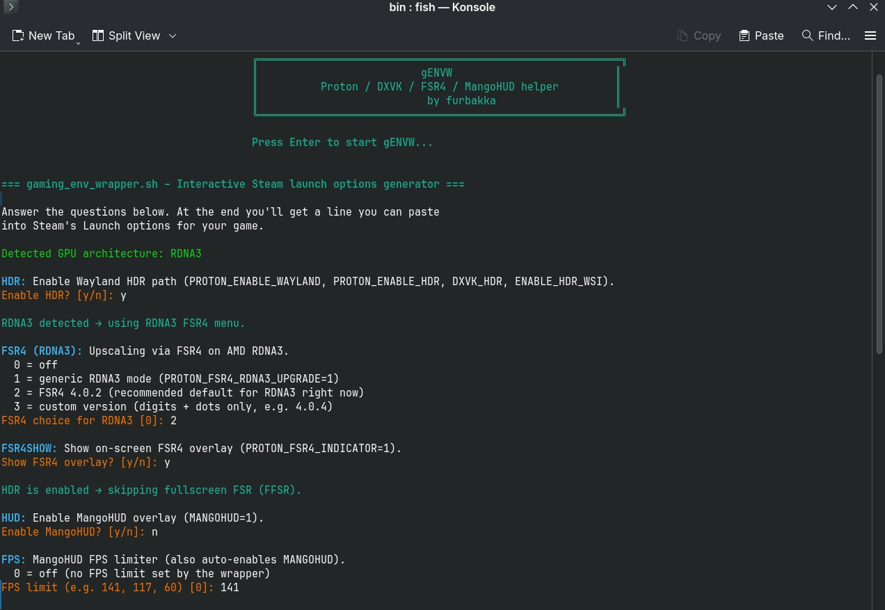
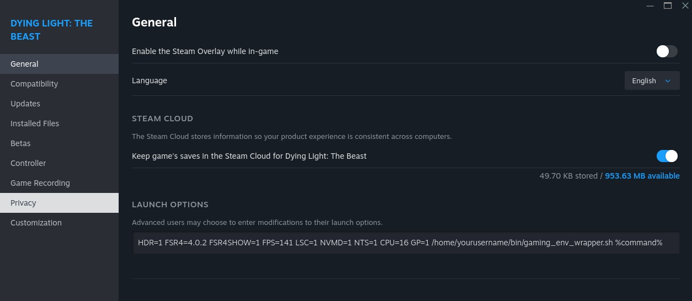

# gaming_env_wrapper (gENVW)

<p align="center">
  
</p>

`gaming_env_wrapper.sh` is a small shell wrapper to control Proton, DXVK, MangoHUD and some CachyOS-related game options using **short environment toggles** in Steam launch options (or from Lutris).

It solves a few problems:

- Some env vars set in **Lutris** don’t always reach **Steam/Proton** reliably.
- Writing huge per-game env strings in Steam like  
  `PROTON_ENABLE_HDR=1 DXVK_HDR=1 PROTON_FSR4_RDNA3_UPGRADE=4.0.2 MANGOHUD=1 ...`  
  is annoying and unreadable.
  The idea is: one script, with short toggles, that you can reuse across games and launchers.

With this wrapper you can do:

```text
HDR=1 FSR4=4.0.2 FPS=141 HUD=1 LSC=1 NVMD=1 NTS=1 CPU=16 GP=1 GM=1 \
/home/youruser/bin/gaming_env_wrapper.sh %command%
```

and the script will translate those short toggles into the correct Proton / DXVK / Wine / MangoHUD env variables.

---

## Features

- **Short toggles instead of walls of env vars**  
  - `HDR=1`, `FSR4=4.0.2`, `FSR4SHOW=1`, `FFSR=3`, `FPS=141`, `HUD=1`, `ASYNC=1`, `CPU=16`, `GP=1`, `GM=1`, …
- **Interactive wizard mode**  
  - If run from a TTY (e.g. terminal), it asks you questions and prints a ready-to-paste Steam launch line.
- **FSR4 management for RDNA3/RDNA4**  
  - Handles the Proton FSR4 env var quirks for RDNA3 and RDNA4.
- **Wayland HDR path**  
  - HDR toggle sets all the relevant Proton/DXVK variables for HDR on Wayland.
- **MangoHUD integration**  
  - FPS limit + HUD toggle in one place.
- **Optional DXVK async, local shader cache, window tweaks, NTSYNC, CPU topology**  
  - One-letter switches instead of remembering variable names.
- **game-performance / gamemoderun integration** (CachyOS & others)  
  - Optional wrapping of your command with `game-performance` and/or `gamemoderun` if installed.
- **Single place to maintain env logic**  
  - If Proton or DXVK change env names later, you only update this script once.

---

## Requirements

- Linux (tested on **Arch / CachyOS**).
- **Steam** with Proton installed.
- Optional extras (only used if toggles are enabled / binaries exist):
  - **MangoHUD** (`MANGOHUD`)
  - **gamemoded** (`gamemoderun`)
  - **game-performance** (CachyOS helper)
  - `pciutils` (`lspci`) – for automatic RDNA detection

---

## Installation

1. **Place the script**

   ```bash
   mkdir -p "$HOME/bin"
   cp gaming_env_wrapper.sh "$HOME/bin/"
   chmod +x "$HOME/bin/gaming_env_wrapper.sh"
   ```

2. **Ensure `$HOME/bin` is in your PATH**

   Example for **fish** (CachyOS default):

   ```fish
   set -U fish_user_paths $HOME/bin $fish_user_paths
   ```

3. **Verify**

   ```bash
   which gaming_env_wrapper.sh
   ```

   You should see something like:

   ```text
   /home/youruser/bin/gaming_env_wrapper.sh
   ```

---

## Quickstart

### Option A: Use the interactive wizard (recommended first time)

Run the script **without arguments** in a terminal:

```bash
gaming_env_wrapper.sh
# or
/home/youruser/bin/gaming_env_wrapper.sh
```

If stdin/stdout are TTYs, the script will:

- Detect your **RDNA generation** (if `lspci` is available).
- Ask questions, for example:
  - Enable HDR? (Wayland HDR path)
  - Which FSR4 version for RDNA3 or RDNA4?
  - Show FSR4 overlay?
  - Use fullscreen FSR (FFSR)?
  - Enable MangoHUD? FPS limit?
  - Enable DXVK async?
  - Use local shader cache?
  - Fake CPU topology? (N logical CPUs)
  - Wrap with `game-performance` and/or `gamemoderun`?

    ## Preview

  <p align="center">
  
  
  </p>

At the end it prints something like:

```text
=== Generated Steam launch options ===

HDR=1 FSR4=4.0.2 FPS=141 HUD=1 LSC=1 NVMD=1 NTS=1 CPU=16 GP=1 \
/home/youruser/bin/gaming_env_wrapper.sh %command%
```

Copy that line and paste it into:

> **Steam → Properties → General → Launch Options**
> 
<p align="center">
  
</p>

---

### Option B: Manual Steam launch options

If you don’t want the wizard, you can write your own toggles directly in Steam:

```text
HDR=1 FSR4=4.0.2 FSR4SHOW=1 FPS=117 HUD=1 LSC=1 NVMD=1 NTS=1 CPU=16 GP=1 GM=1 \
/home/youruser/bin/gaming_env_wrapper.sh %command%
```

The wrapper will translate this into the actual Proton / DXVK / Wine env vars.

> ⚠️ `HDR=1` assumes you are on **Wayland** and HDR is configured.  
> On X11, leave HDR off.

---

### Option C: Lutris → Steam → Proton chain

If you launch Steam games through **Lutris** and Lutris doesn’t reliably pass env vars:

1. In **Lutris**, set the **executable** to:

   ```text
   /home/youruser/bin/gaming_env_wrapper.sh
   ```

2. Put your Steam command as **arguments**, for example:

   ```text
   %command%
   ```

3. Inside **Steam**, use the Launch Options with env toggles as shown above.

This ensures the final Proton process still sees all variables set by `gaming_env_wrapper.sh`.

---

## Env toggles reference

These are the short env variables you set in Steam/Lutris.  
The script translates them into one or more underlying Proton/DXVK/Wine envs.

| Toggle      | Values           | Effect |
|------------|------------------|--------|
| `HDR`      | `0` / `1`        | If `1`: sets `PROTON_ENABLE_WAYLAND=1`, `PROTON_ENABLE_HDR=1`, `DXVK_HDR=1`, `ENABLE_HDR_WSI=1` (Wayland HDR path). |
| `FSR4`     | `0` / `1` / `ver` | **RDNA3 path**: sets `PROTON_FSR4_RDNA3_UPGRADE=1` and optionally a specific FSR4 version (e.g. `4.0.2`, `4.0.4`) via the same variable (see FSR4 details below). |
| `FSR4R4`   | `0` / `1` / `ver` | **RDNA4/global path**: sets `PROTON_FSR4_UPGRADE=1` or `PROTON_FSR4_UPGRADE=<version>`. |
| `FSR4SHOW` | `0` / `1`        | If `1`: `PROTON_FSR4_INDICATOR=1` (on-screen FSR4 overlay). |
| `FFSR`     | `0` / `1–5`      | If HDR is off and `FFSR > 0`: `WINE_FULLSCREEN_FSR=1`. If `FFSR > 1`, sets `WINE_FULLSCREEN_FSR_STRENGTH`. |
| `HUD`      | `0` / `1`        | If `1`: `MANGOHUD=1`. |
| `FPS`      | `0` / `int`      | If `> 0`: enables MangoHUD and sets `MANGOHUD_CONFIG="fps_limit=<FPS>,fps_limit_method=late"`. |
| `DEBUG`    | `0` / `1`        | If `1`: sets `PROTON_LOG=1`, `WINEDEBUG=-all`, `DXVK_LOG_LEVEL=debug`, `VKD3D_DEBUG=warn`, `PROTON_FSR4_INDICATOR=1`. |
| `ASYNC`    | `0` / `1`        | If `1`: `DXVK_ASYNC=1` (recommended only for singleplayer). |
| `LSC`      | `0` / `1`        | If `1`: `PROTON_LOCAL_SHADER_CACHE=1`. |
| `NVMD`     | `0` / `1`        | If `1`: `PROTON_NO_WM_DECORATION=1` (borderless window). |
| `NTS`      | `0` / `1`        | If `1`: `PROTON_USE_NTSYNC=1` (requires `/dev/ntsync`). |
| `CPU`      | `0` / `int`      | If `> 0`: sets `WINE_CPU_TOPOLOGY="N:0,1,...,N-1"` (fake CPU topology). |
| `GP`       | `0` / `1`        | If `1` and `game-performance` exists: wraps the command in `game-performance …`. |
| `GM`       | `0` / `1`        | If `1` and `gamemoderun` exists: runs `gamemoderun …`. |

> **Note:**  
> - `HDR=1` will **disable `FFSR`** in the script – FFSR is only used for SDR titles.  
> - If a toggle is omitted, the script uses its internal default (usually “off”).

---

## FSR4 details and Proton quirks

FSR4 handling in Proton is a bit weird, especially on **RDNA3**:

- On **RDNA3**, Proton uses `PROTON_FSR4_RDNA3_UPGRADE`:
  - `PROTON_FSR4_RDNA3_UPGRADE=1` → enable FSR4 and allow download/upgrade.
  - `PROTON_FSR4_RDNA3_UPGRADE=4.0.2` → also used by Proton to select a specific version.
- On **RDNA4** (and globally), Proton uses `PROTON_FSR4_UPGRADE`:
  - `PROTON_FSR4_UPGRADE=1` → enable upgrade globally.
  - `PROTON_FSR4_UPGRADE=4.0.x` → pick a specific FSR4 version.

The wrapper hides this quirk behind two simple toggles:

- `FSR4=<ver>` → RDNA3 path (`PROTON_FSR4_RDNA3_UPGRADE`).
- `FSR4R4=<ver>` → RDNA4/global path (`PROTON_FSR4_UPGRADE`).

**Downloads are user-global** (per Proton version), not per game:

- The **first run** with FSR4 enabled may trigger a download/upgrade.
- After that, other games using the same Proton build can reuse the installed FSR4 runtime.

---

## RDNA detection

The script tries to detect your AMD GPU using `lspci`:

1. It reads the first line matching `VGA`/`Display` and `AMD`.
2. Based on the model string, it classifies:

   - **RDNA2 (2)** – RX 6xxx patterns (e.g. `6600/6650/6700/6750/6800/6900`)
   - **RDNA3 (3)** – RX 7xxx patterns (e.g. `7600/7700/7800/7900`)
   - **RDNA4 (4)** – guessed RX 9xxx / `9060/9070/9080/9090` naming
   - **`0` (unknown)** – no match, or `lspci` not installed

3. Behaviour based on generation:

   - **RDNA2**: skips FSR4 menus (FSR4 is aimed at RDNA3/4).
   - **RDNA3**: only shows the RDNA3 FSR4 menu (`FSR4` toggle).
   - **RDNA4**: only shows the RDNA4/global FSR4 menu (`FSR4R4` toggle).
   - **Unknown**: shows both menus but uses internal logic to avoid conflicting settings.

If `pciutils` is missing or your GPU name is unusual, detection falls back to **unknown**, but the script still works; you just choose the FSR4 path manually.

---

## Safety

- **No sudo required.**
- Does **not** write to any system files.
- Only sets env vars and then `exec`s your game command (optionally wrapped with `game-performance` / `gamemoderun`).
- **Input validation** in the wizard:
  - Yes/no questions accept only `y` / `n`.
  - Numeric fields reject non-numbers and out-of-range values.
  - `CPU` is capped at the detected logical core count.

Worst case if you misconfigure something: your game may fail to launch or use odd settings. Remove/change the toggles in Steam/Lutris and try again.

---

## Extending the script

The script is just a shell wrapper. You can:

- Add new toggles (e.g. `VKVALIDATION=1`, `ESYNC=0`, etc.).
- Change defaults (for example, enable MangoHUD by default unless `HUD=0`).
- Adjust how `CPU` maps to `WINE_CPU_TOPOLOGY` for your specific CPU.

Keeping the logic in one place (`gaming_env_wrapper.sh`) is much easier than editing dozens of per-game env strings.

---

## License

This project is licensed under the GNU General Public License v3.0 or later (GPL-3.0-or-later).  
See the [LICENSE](./LICENSE) file for details.
